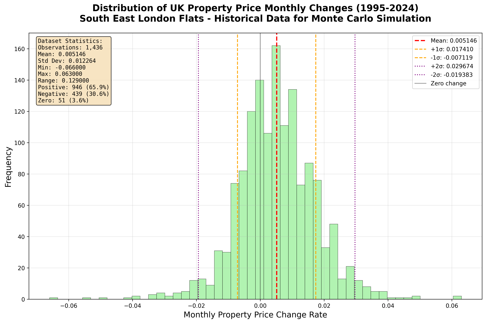

# Help-to-Buy Equity Loan Loss Projection Model

## Overview
This project implements a **stochastic Monte Carlo simulation** to project potential financial outcomes (losses/returns) of Help-to-Buy (HTB) equity loans.  
It models the evolution of **house prices**, **inflation**, **interest rates**, **mortgage balances**, and **HTB loan repayments** over time, generating a distribution of potential future scenarios.

The aim is to understand risk exposure under various economic conditions and assess the 5th, 50th, and 95th percentile outcomes for loan repayments.

---

## Features
- **Stochastic modeling** using Monte Carlo:
  - **Historical UK property prices** (1995-2024) from HM Land Registry for South East London flats
  - **Historical UK inflation data** (1950-2025) from ONS for realistic CPI simulation
  - **Historical UK mortgage rates** (1939-2017) from FRED/Bank of England with 5-year fixed terms
- **Help-to-Buy equity loan logic**:
  - Initial loan as a % of property value (typically 20% in England, 20% in Wales)
  - Equity-based repayment (loan amount grows/shrinks with property value)
  - Interest-free for first 5 years (£1/month management fee only)
  - Interest starts in year 6 at 1.75%, increases annually each April by:
    - 2013-2021 scheme: RPI + 1%
    - 2021-2023 scheme: CPI + 2%
  - Minimum partial repayment: 10% of current property value
  - Full repayment required within 25 years or on sale
  - £200 administration fee for repayments/remortgaging
  - Optional stochastic part-repayments or remortgaging events
- **Mortgage balance simulation** with amortization and refinancing
- **Cash flow tracking** for mortgage + HTB payments
- **Visual outputs**:
  - Distribution of total repayment amounts
  - Percentile bands of outcomes
  - Stress test scenarios (e.g., house price crash + high inflation)

---

## Objectives
- Estimate potential **loss or return** on Help-to-Buy loans under uncertainty.
- Quantify the impact of:
  - **Inflation**
  - **House price growth/decline**
  - **Remortgaging events**
  - **Early repayments**
- Provide **percentile-based projections** (5th, 50th, 95th) for repayments and cash flows.
- Support **stress testing** against extreme but plausible scenarios.

---

## Setup

First-time setup:
```bash
python3 -m venv venv
source venv/bin/activate
pip install -r requirements.txt
```

For subsequent runs:
```bash
source activate.sh
python main.py
```

## Data Sources

This simulation uses **historical UK inflation data** to provide realistic economic modeling:

### Property Price Data
- **Source**: HM Land Registry UK House Price Index
- **Coverage**: January 1995 - December 2024 (1,436 monthly observations)
- **Focus**: South East London areas (London, Inner London, Outer London, South East) - Flats/Apartments
- **Licence**: [Open Government Licence v3.0](https://www.nationalarchives.gov.uk/doc/open-government-licence/version/3/)
- **URL**: [HM Land Registry UKHPI Data Downloads](https://www.gov.uk/government/statistical-data-sets/uk-house-price-index-data-downloads-december-2024)

### Mortgage Rate Data
- **Source**: FRED Economic Data / Bank of England Three Centuries Dataset
- **Coverage**: September 1939 - January 2017 (928 monthly observations)
- **Focus**: UK household variable mortgage rates
- **Licence**: Public Domain Dedication and Licence (PDDL)
- **URL**: [FRED UK Mortgage Rates (HVMRUKM)](https://fred.stlouisfed.org/series/HVMRUKM)

### Consumer Price Index (CPI) Data
- **Source**: UK Office for National Statistics (ONS)
- **Coverage**: January 1950 - June 2025 (906 monthly observations)
- **Licence**: [Open Government Licence v3.0](https://www.nationalarchives.gov.uk/doc/open-government-licence/version/3/)
- **URLs**:
  - Historical rates (1950-1988): [ONS CPI Historical Annual Rate](https://www.ons.gov.uk/economy/inflationandpriceindices/timeseries/jfdz/mm23)
  - Recent data (1988-2025): [ONS CPIH Time Series](https://www.ons.gov.uk/datasets/cpih01)

### Data Processing

**Property Price Changes:**
- Converted to monthly percentage changes from South East London flat prices
- **Mean monthly change**: +0.515%
- **Standard deviation**: 1.226%  
- **Range**: -6.6% to +6.3% monthly



The property price histogram shows 1,436 monthly observations from 1995-2024 for South East London flats. The distribution shows a positive bias (+0.51% monthly mean) with 65.9% positive months vs 30.6% negative, reflecting the long-term upward trend in UK property prices. The distribution has moderate right skew with occasional extreme movements during market crashes (2008) and booms.

**Mortgage Rate Changes:**
- Extracted from historical UK mortgage rates with 5-year lock periods
- **Mean monthly change**: -0.0034%
- **Standard deviation**: 0.2853%
- **Range**: -1.95% to +3.25% monthly


The mortgage rate histogram displays 928 monthly observations from 1939-2017. The distribution shows that rates remained unchanged in 61.7% of months (reflecting 5-year fixed periods), with a slight negative bias (-0.0034% monthly) over the long term. When rates do change, they exhibit higher volatility than CPI but lower than property prices, with extreme movements during periods of economic stress (1970s-1980s inflation, financial crises).

**CPI Changes:**
- Converted annual CPI rates to monthly change deltas for realistic inflation evolution
- **Mean monthly change**: -0.0000% 
- **Standard deviation**: 0.0460%
- **Range**: -0.27% to +0.29% monthly


The histogram above shows the distribution of 905 monthly CPI change observations from 1950-2025. The data exhibits a near-normal distribution centered around zero, with most changes falling within ±0.1% monthly. This provides realistic inflation volatility for the Monte Carlo simulation.

To regenerate datasets:
```bash
python process_cpi_data.py       # CPI inflation data
python process_property_data.py  # Property price data
python process_mortgage_data.py  # Mortgage rate data
```

To generate data validation charts:
```bash
python generate_cpi_histogram.py      # CPI distribution histogram
python generate_mortgage_histogram.py # Mortgage rate distribution histogram  
python generate_property_histogram.py # Property price distribution histogram
```

## Configuration

Edit main.py to configure:
- Number of simulations per repayment year (default: 1,000)
- Maximum repayment year (default: 25 years)
- Mortgage parameters (rate, term, amount)
- Property value and equity loan details

## Running the Simulation

```bash
# Activate virtual environment
source activate.sh

# Run with default settings (1,000 scenarios per year, 0-25 years)
python main.py

# Specify number of scenarios per year
python main.py 10000

# Specify scenarios per year and max repayment year
python main.py 5000 20

# Quick test run (100 scenarios, up to year 5)
python main.py 100 5
```

**Command Line Arguments:**
- `num_scenarios` (optional): Number of scenarios per repayment year (default: 1,000)
- `max_year` (optional): Maximum repayment year to analyze (default: 25, max: 30)

The simulation generates:
- Parallel processing across available CPU cores
- Progress bar for large runs (>1,000 scenarios per year)
- Interactive matplotlib visualization with year slider
- Ranking of repayment strategies by median P&L performance
- Total scenarios = `num_scenarios × (max_year + 1)`

## Output Files

The project includes several data files:

### Generated Property Data Files
- `uk_property_prices_complete.csv` - Full property dataset with dates and regions
- `uk_property_monthly_changes.csv` - **Primary simulation input** - historical monthly property deltas
- `uk_property_changes_[region].csv` - Regional breakdowns (London, Inner London, etc.)

### Generated Mortgage Data Files
- `uk_mortgage_rates_complete.csv` - Full mortgage rate dataset with dates and sources
- `uk_mortgage_monthly_changes.csv` - **Primary simulation input** - historical monthly mortgage deltas
- `uk_mortgage_changes_fred_historical.csv` - Source-specific breakdown

### Generated CPI Data Files
- `uk_cpi_historical_complete.csv` - Full historical dataset with dates and sources
- `uk_cpi_annual_rates.csv` - Annual CPI rates for reference
- `uk_cpi_monthly_changes.csv` - **Primary simulation input** - historical monthly CPI deltas

### Raw Data (Downloaded)
- `uk_mortgage_rates_fred.csv` - Raw FRED mortgage rate data (1939-2017)
- `uk_house_prices_property_type.csv` - Raw HM Land Registry data (1995-2024)
- `historical_cpi_annual_rates.csv` - Raw ONS historical data (1950-1988)
- `cpih_recent_data.csv` - Raw ONS CPIH data (1988-2025)

## Licence and Attribution

- **Property Data**: Contains HM Land Registry data © Crown copyright and database right 2024. Licensed under the [Open Government Licence v3.0](https://www.nationalarchives.gov.uk/doc/open-government-licence/version/3/)
- **Mortgage Data**: UK mortgage rates from FRED/Bank of England Three Centuries Dataset. Licensed under [Public Domain Dedication and Licence (PDDL)](https://opendatacommons.org/licenses/pddl/)
- **CPI Data**: Contains public sector information licensed under the [Open Government Licence v3.0](https://www.nationalarchives.gov.uk/doc/open-government-licence/version/3/)
- **Source Attribution**: 
  - HM Land Registry, UK Government (property prices)
  - FRED Economic Data / Bank of England (mortgage rates)
  - Office for National Statistics (ONS), UK Government (inflation data)
- **Simulation Code**: This project's code is available under the repository licence

When using this data or simulation, please include appropriate attribution to:
1. HM Land Registry for the underlying property price data
2. FRED Economic Data / Bank of England for the underlying mortgage rate data
3. UK Office for National Statistics for the underlying CPI data  
4. This project for the processing and simulation framework
